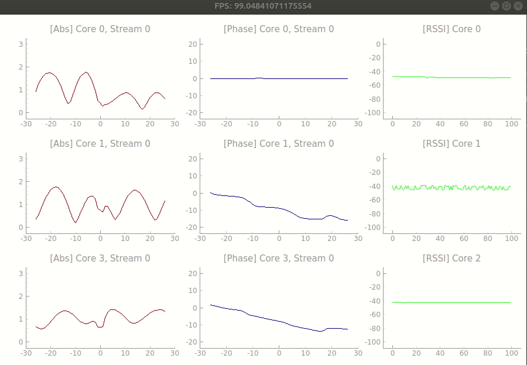

# **Nexmon CSI Collection**

Nexmon Channel State Information Extractor ([Official Website](https://github.com/seemoo-lab/nexmon_csi)) can be used to extract CSI of OFDM-modulated WIFI frames (802.11a/(g)/n/ac) on a per frame basis with up to 80 MHz bandwidth on the Broadcom WiFi Chips

This Repo contains my installation summary and implementation of using Nexmon Tool to collect CSI from ASUS Router, as well as the sanitizing code for CSI processing.

#### Overall Procedure:

***

AP connects to a desktop/laptop through an Ethernet port. User device connects to a normal WIFI, e.g., your home WLAN. After configuration, AP will keep monitoring all the wireless channels and use Tcpdump to capture the packet from a certain MAC address. After analyzing the packet, it will get the CSI.

#### Requirements

***

- Asus RT-AC86U Router. 
  - This router contains bcm4366c0 WIFI Chip. bcm4366e is a updated version and it also works.
  - Set the user name of the router to be `admin` in the login page.
  - Setup SSH keys
    - Run `ssh-keygen -t ed25519` and generate a SSH Key. You can use the default settings.
    - Login to the router Web interface.
    - In Advanced > Administration > System:
      - Enable SSH
      - Copy paste the key from ~/.ssh/id_ed25519.pub
    - Ensure that the router login name is admin. The makefiles need this.
    - Test that the VM is able to ssh into the router
    - `ssh admin@<RT AC86Us IP>` this should happen without asking for a password.
    - Exit ssh. 
- Device that you want to get the CSI. I used a Samsung Phone.


#### Install Nexmon

***

- Download and extract [nexmon_compiled.zip](https://github.com/zikunliu6/CSI_Extraction_Nexmon/blob/main/nexmon_compiled.zip)
  - This zip file contains the nexmon core firmware dhd.ko, nexutil, makecsiparams and tcpdump
  - The original installation from official website doesn't support RSSI extraction which makes the CSI amplitude meaningless, but ours support.
- Copy the contents to the `/jffs/` partition of your router: `scp ./nexmonster-rtac86u/* admin@<routers-ip>:/jffs/`
- Make `nexutil`, `makecsiparams`, and `tcpdump` executable: `ssh admin@<routers-ip> "/bin/chmod +x /jffs/nexutil /jffs/mcp /jffs/tcpdump "`


#### Run CSI Collection

***

- Setup parameters in `csi_live/plot_live.py` including router IP, device MAC, number of antennas, etc.

  - Core_mask means the antenna index. Let's say you want to collect data from antenna 0 and 1, then it should be 0011, which is 3.
  - Stream_mask is recommended to be 1.

- Ping your device constantly:

  ```
  sudo ping -i 0.1 <your device ip address>
  ```

- Run `csi_live/plot_live.py` and you will get the real-time CSI collection like this:

  

  - Note that, the first column means the amplitude of the CSI, the second column means the phase ratio between itself and antenna number 0, the third column means the RSSI in dBm.